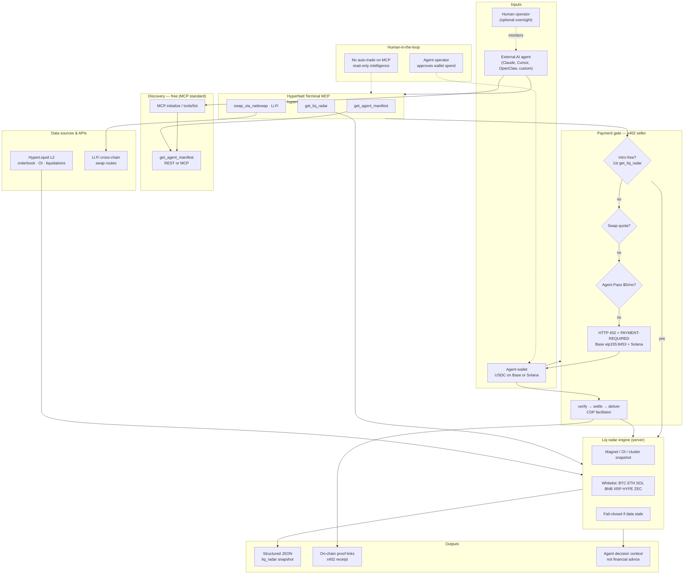
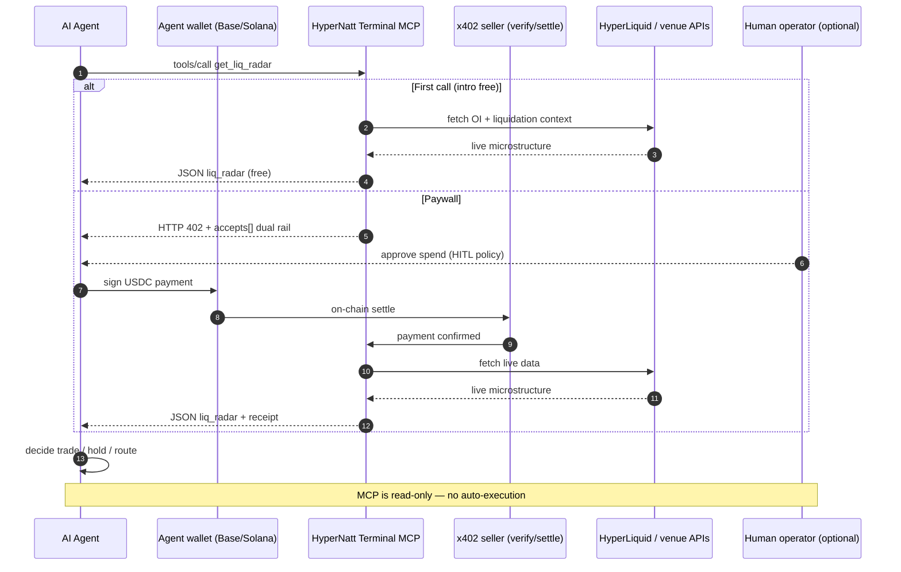

# HyperNatt Terminal — Agentic Workflow Diagram

**Future Caribbean Global AI Buildathon · Track 02 — Finance, Payments & MSME Capital**  
**OpenClaw stack alignment:** MCP · x402 · agent-native payments · GOAT / Base / Solana

> Diagram for application form. GitHub renders Mermaid below.

**Historical diagram scope, MCP v2.7.0 — 3 tools:** `get_agent_manifest`, `get_liq_radar`, `swap_via_nattswap`.

The current **v2.9.1** catalog has **4 tools**: `get_agent_manifest`, `get_liq_radar`,
`swap_via_nattswap`, `get_native_depth`. Native depth is BTC/ETH only; see [native-depth.md](native-depth.md).

---

## System overview

---

## Sequence — agent pays and reads liq radar

---

## Key decision points

| Step | Decision | Fail mode |
|------|----------|-----------|
| Tool discovery | MCP `tools/list` (3 tools) | Standard MCP errors |
| Intro eligibility | First `get_liq_radar` | Falls through to paywall |
| Payment | x402 verify → settle before deliver | 402 until paid; no grant on failed settle |
| Data freshness | Stale feed | Fail-closed / degraded flag |
| Agent action | Agent chooses use of JSON | No server-side auto-trade |

---

## Links

| Resource | URL |
|----------|-----|
| MCP endpoint | https://hypernatt.com/mcp/protocol |
| Server card | https://hypernatt.com/.well-known/mcp/server-card.json |
| Repo | https://github.com/DIALLOUBE-RESEARCH/hypernatt-terminal |
| Loom (application) | https://www.loom.com/share/618c17521a964a60a6b6605c196a6460 |

---

MIT · DIALLOUBE-RESEARCH · HyperNatt Terminal v2.7.0
