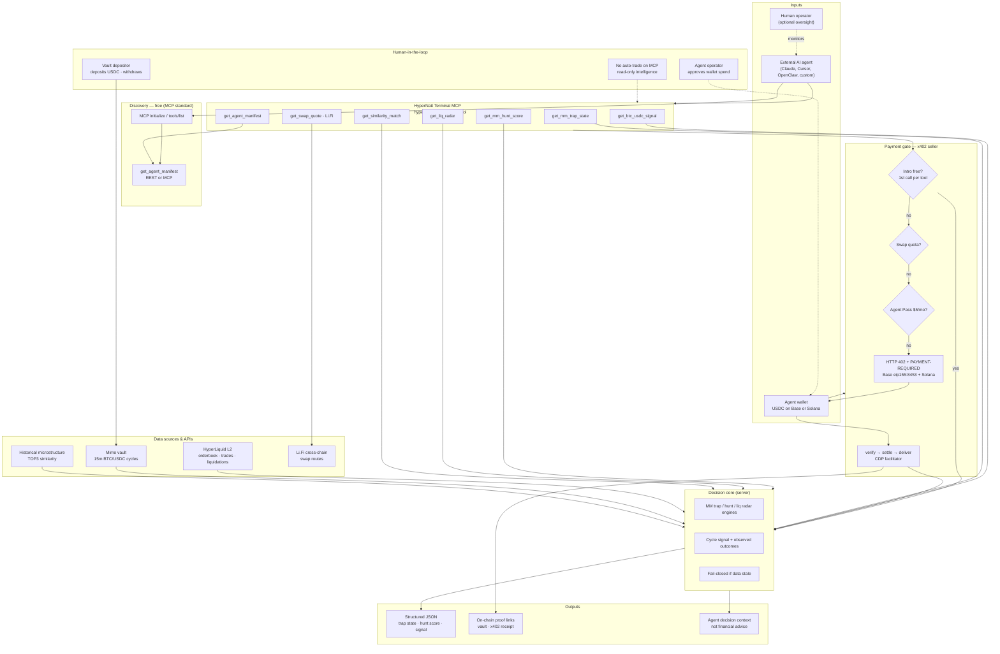
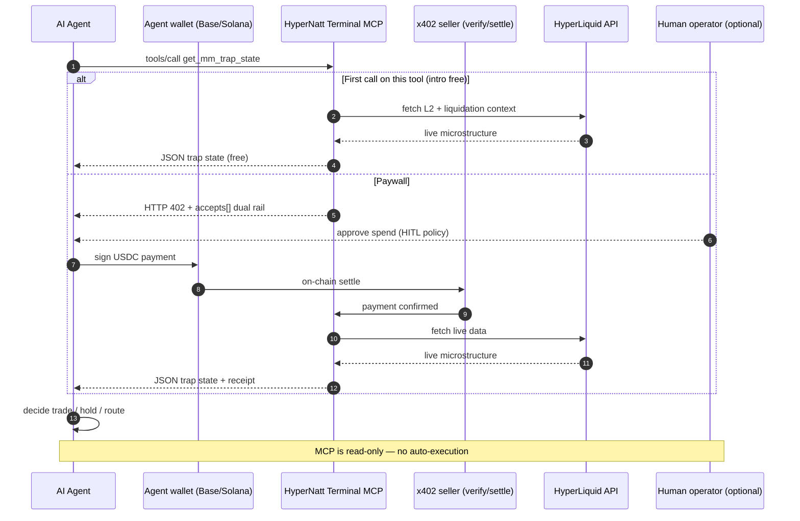

# HyperNatt Terminal — Agentic Workflow Diagram

**Future Caribbean Global AI Buildathon · Track 02 — Finance, Payments & MSME Capital**  
**OpenClaw stack alignment:** MCP · x402 · agent-native payments · GOAT / Base / Solana

> Diagram for application form. GitHub renders Mermaid below.

---

## System overview

---

## Sequence — agent pays and reads MM trap state

---

## Key decision points

| Step | Decision | Fail mode |
|------|----------|-----------|
| Tool discovery | MCP `tools/list` | Standard MCP errors |
| Intro eligibility | Per-tool first call | Falls through to paywall |
| Payment | x402 verify → settle before deliver | 402 until paid; no grant on failed settle |
| Data freshness | Stale HL feed | Fail-closed / degraded flag |
| Agent action | Agent chooses use of JSON | No server-side auto-trade |
| Vault (parallel) | Human deposits USDC | Non-custodial; on-chain only |

---

## Links

| Resource | URL |
|----------|-----|
| MCP endpoint | https://hypernatt.com/mcp/protocol |
| Server card | https://hypernatt.com/.well-known/mcp/server-card.json |
| Live vault proof | https://app.hyperliquid.xyz/vaults/0x04e2eb302fe9ff23a9d1f2455084af624737a6d8 |
| Repo | https://github.com/DIALLOUBE-RESEARCH/hypernatt-terminal |
| Loom (application) | https://www.loom.com/share/618c17521a964a60a6b6605c196a6460 |

---

MIT · DIALLOUBE-RESEARCH · HyperNatt Terminal v2.5.11
